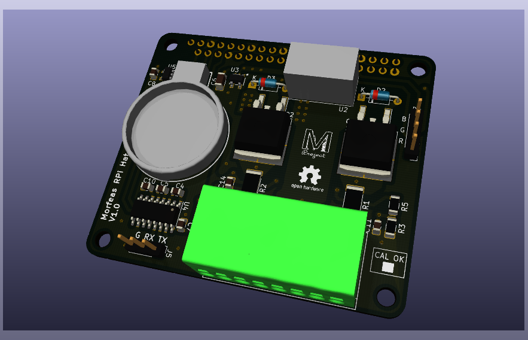

# Morfeas PRi Hat

This repository related to PCB design of the Morfeas RPi Hat and the supporting software.

## Authors
* **Sam Harry Tzavaras** - *Initial work*

## License
The hardware PCB design is licensed under TAPRv1 or later - see the [License](https://gitlab.com/fantomsam/wind_station/raw/master/Design_and_source/Hardware/TAPR_Open_Hardware_License_v1.0.pdf?inline=false) file for details.

The source code is licensed under GPLv3 or later - see the [License](License) file for details.

The Technical manual is licensed under FDLv1.3 or later - see the [License](https://gitlab.com/fantomsam/wind_station/raw/master/Docs/Documentation/fdl-1.3.pdf?inline=false) file for details.
